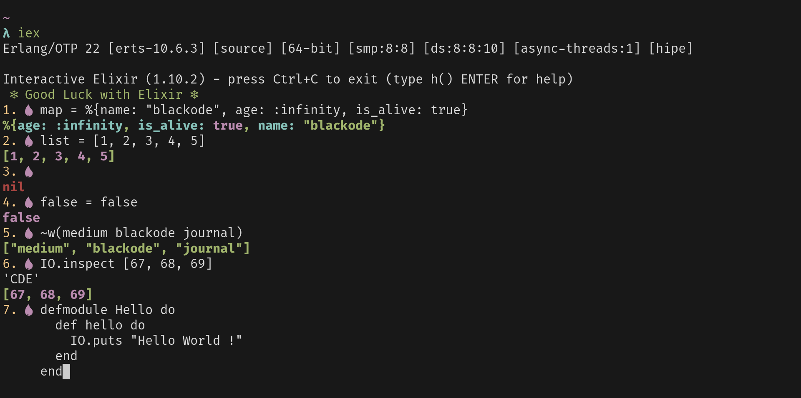

# custom-iex
The custom iex configuration for Elixir Developers.


## Installation

```shell
 git clone https://github.com/blackode/custom-iex.git
 cd custom-iex
 chmod +x install
 ./install
```



Happy Coding and Keep smiling :)
